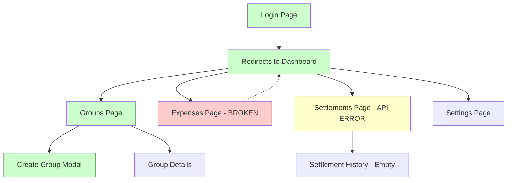
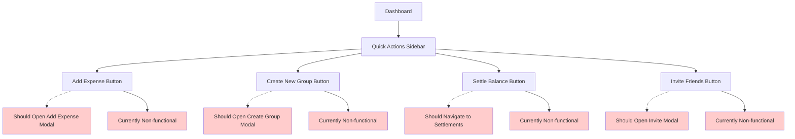

# Navigation Flow Analysis

## Current Navigation Structure

```
Split With Claude (Splitwise MVP)
├── Dashboard (/) ✅
├── Groups (/groups) ✅
├── Expenses (/expenses) ❌ (Redirects to Dashboard)
├── Settlements (/settlements) ⚠️ (Loads but shows API error)
└── Settings (/settings) ❓ (Not tested)
```

## Navigation Flow Diagram



## Navigation Issues Identified

### Critical Issues (Red)
1. **Expenses Page Navigation**
   - Status: ❌ Completely broken
   - Behavior: Clicking "Expenses" link redirects to Dashboard
   - Impact: Users cannot access core expense management
   - Root Cause: React Router configuration issue

### Major Issues (Yellow)
2. **Settlements Page API Error**
   - Status: ⚠️ Page loads but shows error
   - Behavior: "Failed to load settlements" error message
   - Impact: Settlement system (crown jewel) unusable
   - Root Cause: API endpoint failure

### Working Navigation (Green)
3. **Dashboard Navigation**
   - Status: ✅ Working correctly
   - All dashboard components load properly

4. **Groups Page Navigation**
   - Status: ✅ Working correctly
   - Create group modal functions properly

## Quick Action Button Flow



## Recommended Navigation Fixes

### 1. Fix Expenses Page Routing

**Current Issue**: `/expenses` redirects to Dashboard
**Expected Behavior**: Navigate to dedicated Expenses page

**Fix Required**: Check React Router configuration in `apps/web/src/App.tsx`

### 2. Fix Settlements API

**Current Issue**: API returns error "Failed to load settlements"
**Expected Behavior**: Load settlements data or show empty state

**Fix Required**: Check API endpoint `/api/v1/settlements`

### 3. Fix Quick Action Buttons

**Current Issue**: Buttons don't trigger expected actions
**Expected Behavior**: Open modals or navigate to appropriate pages

**Fix Required**: Add event handlers and modal state management

## User Journey Impact

### Broken User Journeys
1. **Add Expense Flow**
   - User clicks "Add Expense" → Nothing happens
   - User navigates to Expenses page → Redirects to Dashboard
   - **Result**: Cannot add expenses (core feature)

2. **Settlement Flow**
   - User navigates to Settlements → API error
   - User cannot view or manage settlements
   - **Result**: Cannot use settlement system (crown jewel)

3. **Quick Actions Flow**
   - User clicks any quick action → Nothing happens
   - **Result**: Primary CTAs non-functional

### Working User Journeys
1. **Group Management Flow**
   - User navigates to Groups → Works correctly
   - User creates new group → Modal opens and functions
   - **Result**: Group management fully functional

2. **Authentication Flow**
   - User logs in → Works correctly
   - User navigates to Dashboard → Works correctly
   - **Result**: Authentication system working

## Navigation Priorities

### Priority 1: Critical (Fix Immediately)
- Fix Expenses page routing
- Fix Settlements API error
- Fix Quick Action buttons

### Priority 2: High (Fix Soon)
- Add loading states for navigation
- Add error handling for failed navigations
- Test Settings page navigation

### Priority 3: Medium (Improve Later)
- Add navigation breadcrumbs
- Add page transition animations
- Improve mobile navigation UX

## Navigation Testing Checklist

### Core Navigation Tests
- [ ] Dashboard → Groups (✅ Working)
- [ ] Dashboard → Expenses (❌ Broken)
- [ ] Dashboard → Settlements (⚠️ API Error)
- [ ] Dashboard → Settings (❓ Not Tested)
- [ ] Direct URL navigation to all routes

### Quick Action Tests
- [ ] Add Expense button (❌ Broken)
- [ ] Create New Group button (❌ Broken)
- [ ] Settle Balance button (❌ Broken)
- [ ] Invite Friends button (❌ Broken)

### Mobile Navigation Tests
- [ ] Hamburger menu functionality
- [ ] Touch navigation on mobile
- [ ] Responsive navigation layout

## Technical Implementation Notes

### Router Configuration Check
```typescript
// Expected route configuration
<Route path="/expenses" element={<ExpensesPage />} />
<Route path="/settlements" element={<SettlementsPage />} />
<Route path="/groups" element={<GroupsPage />} />
<Route path="/settings" element={<SettingsPage />} />
```

### Navigation Component Structure
```
src/components/
├── layout/
│   ├── Navigation.tsx (Side navigation)
│   ├── Header.tsx (Top header with Add Expense)
│   └── MobileNavigation.tsx (Mobile menu)
├── dashboard/
│   └── QuickActions.tsx (Quick action buttons)
└── common/
    └── Button.tsx (Reusable button components)
```

This navigation analysis reveals that while the basic application structure is sound, critical navigation failures prevent users from accessing core functionality. The fixes should prioritize restoring basic navigation before implementing enhancements.